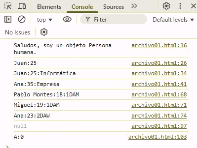

# Práctica 3 del curso de Git&Docker
Para hacer esta práctica utilizo como código de ejemplo la implementación de POO en JavaScript.
Existe diferentes formas de crear objetos en JavaScritp:
- Notación literal de objeto.
- Constructor new Object.
- Con Object.create().
- Clases (ES6)

## Implementación de la herencia en JavaScript
La herencia se puede implementar en JavaScritp de diferentes formas. Podemos destacar la que utiliza la **sintaxis ES6 (class)** y la que se hace con **Object.create**.

El resultado de la ejecución del código del archivo *archivo01.html* es el siguiente:   

